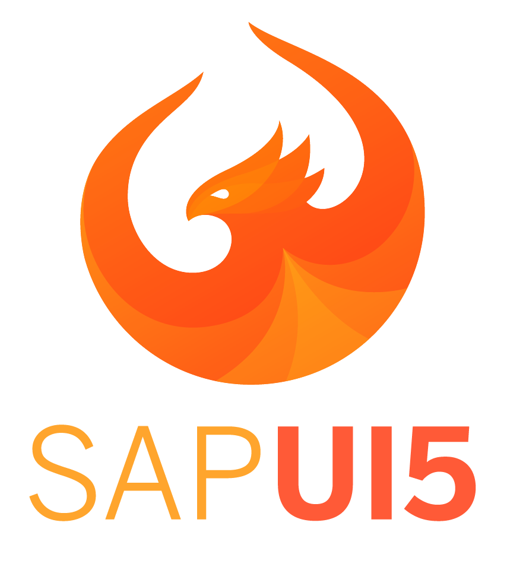
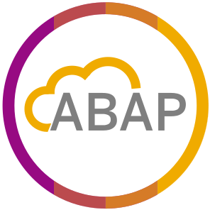
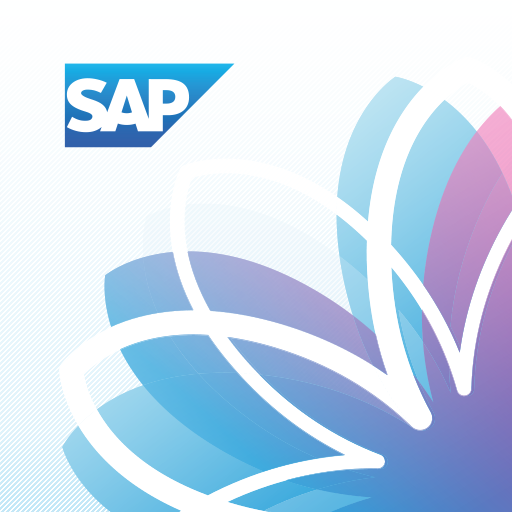
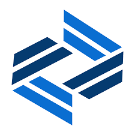

### Hey! Nice to see you. 👋

 
  <samp>
    <a href="https://www.google.com/search?q=Herbert+Kaintz">「 Google Me 」</a>
     
    「 I'm Herbert, a SAP fullstack developer from  <b>Austria</b>. 」
     
     
  </samp>

### Stuff I work with

<!--
**hkaintz/hkaintz** is a ✨ _special_ ✨ repository because its `README.md` (this file) appears on your GitHub profile.

Here are some ideas to get you started:

- 🔭 I’m currently working on ...
- 🌱 I’m currently learning ...
- 👯 I’m looking to collaborate on ...
- 🤔 I’m looking for help with ...
- 💬 Ask me about ...
- 📫 How to reach me: ...
- 😄 Pronouns: ...
- ⚡ Fun fact: ...
-->
